# Deep Learning: From Tokens to Transformers

## The Two-Step Process: Tokenization and Embedding

To get words into matrices for neural networks, we use a two-step process: **Tokenization** and **Embedding**.

Before we even touch neural networks, we need a **Vocabulary (Dictionary)**. Each unique word in your data is assigned a specific index:

yassin -> 104 <br>
is -> 25 <br>


### Tokenizer Algorithm Examples

- **Whitespace Tokenization**  
  *Algorithm:* Splits text at spaces, tabs, or newlines.  
  *Example:* `"This is a sentence."` becomes `["This", "is", "a", "sentence."]`.

- **Word Tokenization**  
  *Algorithm:* Uses rules to split text into words, often handling punctuation.  
  *Example:* `"I love pizza!"` becomes `["I", "love", "pizza", "!"]`.

- **Character Tokenization**  
  *Algorithm:* Splits text into individual characters.  
  *Example:* `"Hello"` becomes `["H", "e", "l", "l", "o"]`.

- **Subword Tokenization (e.g., BPE)**  
  *Algorithm:* Merges frequent character pairs into new tokens, balancing word and character-level granularity.  
  *Example:* `"unhappiness"` might become `["un", "happi", "ness"]`, handling the prefix `"un-"` and suffix `"-ness"`.

#### Modern Industry Standards (2026)

Subword tokenization algorithms are the industry standard for Large Language Models (LLMs) like GPT-4 because they balance vocabulary size with the ability to handle rare words.

- **Byte Pair Encoding (BPE):** Used by GPT models; iteratively merges the most frequent pairs of characters or tokens.<br>
  more info : https://vizuara.substack.com/p/understanding-byte-pair-encoding
- **WordPiece:** Used by BERT; similar to BPE but uses a likelihood-based merging strategy.
- **SentencePiece:** A language-neutral system that treats whitespace as a normal symbol, effective for languages like Chinese or Japanese that don't use spaces.
- **Unigram:** A statistical algorithm that starts with a large vocabulary and prunes it based on probability of occurrence in a corpus.

---

## Dictionary Creation

### 1. Who Creates the Dictionary? (The Engineer + The Algorithm)

The engineer doesn't write the dictionary. Instead, the engineer chooses a **Tokenizer** (a specialized algorithm) and a **Corpus** (a massive pile of text).

- **The Corpus:** This is where "all possible words" come from. For models like **BERT** or **RoBERTa**, engineers used almost all of English **Wikipedia** and thousands of digital books (**BookCorpus**).

- **The Tokenizer:** The engineer runs an algorithm (like *WordPiece* for BERT or *BPE* for RoBERTa) over that massive text. The algorithm counts how often every word appears.

- **The Selection:** The algorithm keeps the top, most frequent words (e.g., the top 30,000) and discards the rest. This final list of 30,000 words/sub-words is your "Dictionary".

### 2. Is It a "Real" Dictionary?

**No.** A real dictionary (like Oxford or Larousse) is too limited for AI.

- **The Problem:** Real dictionaries don't have slang, typos, or new tech words like "ChatGPT" or "TikTok."
- **The AI Solution (Sub-words):** If a word isn't in its 30,000-word list, the AI breaks it into pieces.  
  *Example:* If the dictionary doesn't have **"Yassine"**, it might see it as **"Yass"** + **"ine"**.  
  This way, the model can understand *any* word in the world—even if it has never seen it before—by looking at its parts.

### 3. Converting to Vectors: The "Learning" Phase

You asked: *"Use the real dictionary and convert it to vectors?"*  
The answer is: **We don't convert them; we let the model "invent" them.**

1. **Initial State:** Every word in that 30,000-word list is assigned a **random vector** (768 random numbers). At this stage, the word "king" and "apple" look exactly the same to the AI—just random noise.
2. **Training:** As you train the model on Wikipedia, it sees "king" near "queen" and "palace" millions of times.
3. **The Optimization:** The model adjusts those 768 numbers so that "king" and "queen" become mathematically similar (their dot product becomes high).
4. **The Result:** The "real" vector isn't found in a book; it is a **learned representation** of how that word is used in human history.

→ Now how do we get from a simple ID like `104` to a vector of 768 numbers? **We use an embedding matrix**:  
Size of this matrix: if our dict has 30K words and our dimension is 768, this matrix is 30,000 × 768.  
Because the model searches in this matrix.

---

## Understanding Embedding Vectors

### What Each Number in the Vector Means (768 Dimensions)

Each number in a 768-dimension vector (embedding) represents a **Feature** or a **Semantic Dimension**.

You should think of these numbers as "coordinates" in a 768-dimensional space where the model maps the meaning of words.

#### 1. What a "Feature" Actually Is

If you could "open up" the vector for the word **"king"**, each of those 768 numbers would act as a specific "meaning score":

- **Dimension 1 (Gender):** Might be a high positive number like **0.95**, representing "Masculinity."
- **Dimension 2 (Royalty):** Might be **0.88**, representing "Power/Ruler."
- **Dimension 3 (Food):** Might be **-0.01**, because a king is not typically an object you eat.
- **Dimension 4 (Age):** Might be **0.40**, representing a tendency toward being an "Adult."

#### 2. Human vs. AI Understanding

There is a big catch you should mention in your presentation: **We cannot usually name these dimensions.**

- **Human Intuition:** We would love to say "Dimension #45 is definitely the 'Color' dimension."
- **AI Reality:** The model finds its own 768 patterns that work best for math. Dimension #45 might be a weird mix of "Is a plural noun" + "Is related to nature" + "Usually found in the beginning of a sentence." This is called **Distributed Representation**.

#### 3. Why 768? (The "Resolution" of Meaning)

Why not just 3 numbers? Because human language is too complex.

- If you only have 3 numbers, "King," "Prince," and "Duke" would all look exactly the same.
- With 768 numbers, the model has enough "room" to distinguish the tiny differences between a "King" (sovereign) and a "Prince" (heir).

> so feature like parameter? :

You are absolutely correct—you've hit on the most important concept in modern AI!

Yes, every one of those 768 numbers is a **parameter**. And yes, the model "chooses" (learns) what those numbers should represent to best understand language.

#### 1. Who Creates the "Gender" Column?

In the old days of AI, engineers tried to manually create columns:

- Column 1: Gender
- Column 2: Royalty
- Column 3: Is a name?

**But humans are bad at this.** We can't think of 768 different categories for every word in the world.

So, we let the **Model** do it. We give the model 768 "empty slots" (random numbers) for the word "Yassine". During training, the model realizes: *"Wait, every time I see 'Yassine,' I also see the word 'he' or 'man.' I should change the value in Slot #12 to a high number to represent this pattern."*

#### 2. The Model as the "Decision Maker"

The model "chooses" the best features through **optimization**.

- It doesn't "know" what gender is in a human sense.
- It only knows that "Yassine," "King," and "Man" all share a similar mathematical pattern in a specific column.
- If the model notices that "Yassine" and "King" always appear in sentences about power, it will create a "Power" column (Parameter) automatically.

#### 3. "Yassine" in the Vector vs. the Word

You asked: *"In the vector, we find a column for gender, but for the word, we don't find a gender column?"*

Exactly!

- **The Text Word:** "Yassine" is just 7 letters. It contains no metadata.
- **The Vector (Embedding):** This is where the "hidden meaning" lives. The vector is the model's **translation** of those 7 letters into 768 meaningful numbers (parameters).

---

## RNN: Structure and Calculations


→ How do the calculations happen?

### 1. The Initial Hidden State ($a^{<0>} = \vec{0}$)

Is typically a vector of zeros.

- **The Reason:** Since "Yassine" is the very first word, the model has no "past" to remember yet. The zeros simply represent an "empty memory".

### 2. The Weights ($W_{aa}$ and $W_{ax}$) Are the "Brain"

Think of the weights as the model's **knowledge of the English language**.

- **Initialization:** When you start training, these matrices are filled with **small random numbers**, not zeros.
- **Learning:** During training, the model adjusts these numbers so it can understand that if the first word is a name like "Yassine," the next word is likely a verb like "is."

### 3. The Math for the First Word

Let's look at your equation for the first step:

- **The $W_{aa} a^{<0>}$ part:** Because it multiplies by the zeros of $a^{<0>}$, this part becomes zero **for this step only**. The "memory" contribution is empty.
- **The $W_{ax} x^{<1>}$ part:** This is where the magic happens! $W_{ax}$ (which is NOT zero) multiplies the vector for "Yassine" ($x^{<1>}$). This allows the model to capture the meaning of the first word and store it in the new hidden state $a^{<1>}$.

#### Example:

Let's look at the "Yassine" calculation with real numbers. To keep the math simple for your presentation, we will use an embedding size of **3** and a hidden size of **3** (instead of 768).

**1. The Inputs**

- **$x^{<1>}$ (Embedding for "Yassine"):** $[1, 2, 3]^T$
- **$W_{ax}$ (Learned Weights):**
  $$
  \begin{bmatrix}
  0.1 & 0.2 & 0.3 \\
  0.4 & 0.5 & 0.6 \\
  0.7 & 0.8 & 0.9
  \end{bmatrix}
  $$

**2. The Step-by-Step Multiplication ($W_{ax} \cdot x^{<1>}$)**

This is a **Matrix-Vector Multiplication**, which is essentially **3 separate dot products**.

- **Dot Product 1 (Top row):**  
  $(0.1 \times 1) + (0.2 \times 2) + (0.3 \times 3) = 0.1 + 0.4 + 0.9 = \mathbf{1.4}$

- **Dot Product 2 (Middle row):**  
  $(0.4 \times 1) + (0.5 \times 2) + (0.6 \times 3) = 0.4 + 1.0 + 1.8 = \mathbf{3.2}$

- **Dot Product 3 (Bottom row):**  
  $(0.7 \times 1) + (0.8 \times 2) + (0.9 \times 3) = 0.7 + 1.6 + 2.7 = \mathbf{5.0}$

**3. The Result**

The output of the $W_{ax}$ part is a new vector:
$$
\begin{bmatrix}
1.4 \\
3.2 \\
5.0
\end{bmatrix}
$$

**What happens next in the formula?**

According to the RNN equation:

1. **Addition:** This result $[1.4, 3.2, 5.0]$ is added to the memory part ($W_{aa} a^{<0>}$) and the bias ($b_a$).
2. **Activation:** The sum goes into $g$ (tanh) to squash the numbers between -1 and 1.
3. **Final State:** The result is $a^{<1>}$—the model's first "memory" of "Yassine".

→ How do we choose $b$?

$b_a$ is a learnable parameter, exactly like the weight matrices $W_{ax}$ and $W_{aa}$.  
$b$ is also a matrix.

So the result is a matrix like this:
$$
a^{<1>} = \begin{bmatrix}
0.885 \\
0.997 \\
1.000
\end{bmatrix}
$$

### Calculating the Output $y$

- **$W_{ya}$ (Learned Weights):** $\begin{bmatrix} 0.5 & -0.1 & 0.8 \end{bmatrix}$ (Size $1 \times 3$)
- **$b_y$ (Bias):** $[0.1]$

This is the final step of the RNN process—taking the "memory" you just created and turning it into an actual **prediction**.

In your diagrams, the notation in the weight matrix stands for **"from $y$ to $a$"**. This matrix is the "bridge" between the hidden layer and the final output layer.

#### 1. The Output Equation

According to your slide, the output $\hat{y}$ is calculated as:

- **$a^{<1>}$:** This is the hidden state (the "memory") you just calculated.
- **$W_{ya}$:** This is a learned weight matrix that translates that memory into something the outside world understands (like a word prediction).
- **$g$:** This is the second activation function, usually a **Softmax** if we are trying to choose a word from a dictionary.

#### 2. Practical Example Using Our "Yassine" Results

Let's use the $a^{<1>}$ vector we just calculated: $[0.885, 0.997, 1.000]^T$.

Imagine our model is trying to predict if the sentence is "Positive" or "Negative." Our output $\hat{y}$ only needs to be **one number** (Probability).

**The Setup:**

- **Input $a^{<1>}$:** $[0.885, 0.997, 1.000]^T$
- **$W_{ya}$ (Learned Weights):** $[0.5, -0.1, 0.8]$ (Size $1 \times 3$)
- **$b_y$ (Bias):** $[0.1]$

**The Math Step-by-Step:**

1. **The Dot Product ($W_{ya} \cdot a^{<1>}$):**  
   $(0.5 \times 0.885) + (-0.1 \times 0.997) + (0.8 \times 1.000)$  
   $= 0.4425 - 0.0997 + 0.8 = \mathbf{1.1428}$

2. **Add Bias:**  
   $1.1428 + 0.1 = \mathbf{1.2428}$

3. **Apply $g$ (Sigmoid for probability):**  
   $\text{Sigmoid}(1.2428) \approx \mathbf{0.776}$

**The Result ($\hat{y}$):** 0.776. This means the model is **77.6% sure** that after the word "Yassine," the sentence is heading in a positive direction.

---

## RNN Limitations

### 1. Vanishing and Exploding Gradients

This remains the most famous drawback. During training, as errors are backpropagated through many time steps (Backpropagation Through Time), the gradients are repeatedly multiplied by weights.

- **Vanishing:** Gradients become extremely small, approaching zero, which prevents the network from learning long-term dependencies because the weights in earlier layers stop updating.
- **Exploding:** Gradients grow exponentially large, causing numerical instability and making the model's weights diverge.

### 2. Sequential Processing Bottleneck

RNNs process data linearly (word by word), meaning the computation for the current step depends on the result of the previous step.

- **Lack of Parallelism:** Unlike Transformers, which process entire sequences at once, RNNs cannot fully leverage modern parallel hardware like GPUs/TPUs, leading to significantly slower training and inference times for long sequences.

### 3. Limited "Long-Term" Memory

Even with variants like LSTMs or GRUs, basic RNNs struggle to maintain information across long gaps.

- **Bias Towards Recent Data:** The "hidden state" (memory) is a fixed size. As new information arrives, older context is progressively diluted or overwritten, causing the model to "forget" the beginning of a long document by the time it reaches the end.

### 4. Difficulty with Global Context

Because RNNs process sequences in a specific order (usually left-to-right), they often fail to capture the "global" context of a sentence where a word's meaning might depend heavily on a word that appears much later.

> Their solution solved the vanishing problem is LSTM but also still processes data linearly (word by word).

→ That's why engineers created the **"Attention Is All You Need"** paper.

---

## Transformers

Look at every word simultaneously. There is no previous state $a^{(t-1)}$. It uses **Self-Attention** instead of $W_{ax}$, $W_{aa}$.

In Transformers, we have new weight matrices that act as a "search engine" for meaning:

- **Query (Q):** What a word is looking for.
- **Key (K):** What a word contains (like identity).
- **Value (V):** The actual information the word provides once a match is found.

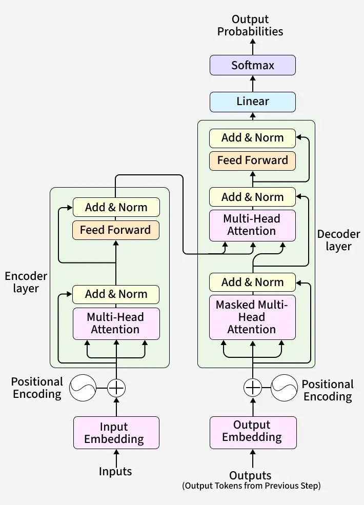  


Let's look at the word "king" and see how it interacts with the rest of the sentence.  
*(Example: "Yassine is the king of the world") hhhh.*

- **Query ($Q$):** Think of this as a Search Query.  
  For "king": *"I am a royal title. Is there a person or a name in this sentence that I belong to?"*

- **Key ($K$):** Think of this as a Label or Identity Card.  
  For "Yassine": *"I am a proper noun, a person, and a subject."*  
  For "world": *"I am a physical location/concept."*

- **Value ($V$):** Think of this as the Information the word carries.  
  For "Yassine": The actual semantic meaning of "Yassine."

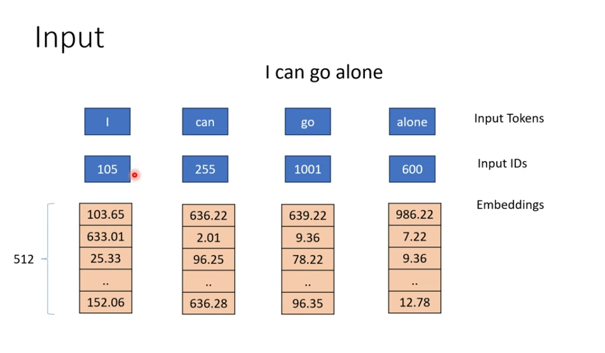

### 📌 What's Happening in This Image?

This image shows **how raw text gets converted into numerical vectors (embeddings)** that the Transformer model can understand and process.

Let's break it down:

#### ✅ Step 1: Input Text → Tokens

> **Text**: `"I can go alone"`

The model first splits this sentence into individual units called **tokens**.

- `I`
- `can`
- `go`
- `alone`

These are your **Input Tokens**.

💡 *Note*: In real models like BERT or GPT, tokenization can be more complex (e.g., subword tokens like "go" vs "goes"), but for simplicity, this example uses whole words.

#### ✅ Step 2: Tokens → Token IDs

Each token is mapped to a unique number using a **vocabulary lookup table** (like a dictionary).

So:
- `"I"` → `105`
- `"can"` → `255`
- `"go"` → `1001`
- `"alone"` → `600`

These are called **Input IDs**.

🧠 Think of this like assigning each word an ID card so the computer can recognize it numerically.

#### ✅ Step 3: Token IDs → Embeddings

Now, each token ID is converted into a **vector (list of numbers)** called an **embedding**.

In this case, each embedding has **512 dimensions** — meaning each word becomes a vector with 512 floating-point numbers.

Example:
- `"I"` → `[103.65, 633.01, 25.33, ..., 152.06]` ← 512 numbers
- `"can"` → `[636.22, 2.01, 96.25, ..., 636.28]`
- etc.

🎯 **Why?** Because neural networks can't work directly with words or IDs — they need dense numerical representations that capture semantic meaning. These embeddings are learned during training and encode things like meaning, context, and relationships between words.

#### 💡 Important Notes:

- The **embedding layer** is usually a simple lookup table (a matrix) where each row corresponds to a word/token.
- The size `512` is common in early Transformer papers (like "Attention Is All You Need") — modern models may use 768, 1024, or even 4096 dimensions.
- These embeddings are often combined later with **positional encodings** (we'll see that next!) because Transformers don't inherently know word order.

#### 🧠 Pro Tip for Learning:

When studying Transformers, always ask yourself:  
> *"What does the model 'see' at this stage?"*

At this point, it sees **a sequence of 512-dimensional vectors**, one per token — ready to be fed into the next part: **Positional Encoding + Self-Attention**.

---

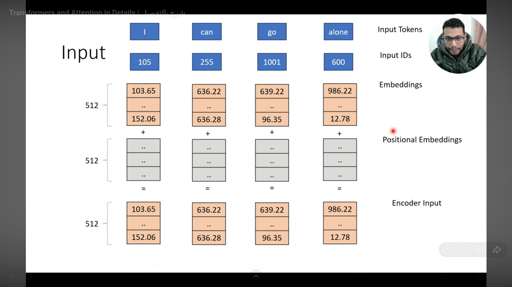

### ❓ Why Do We Need Positional Encoding?

Remember: Transformers don't have recurrence (like RNNs) or convolution (like CNNs). They process all tokens **in parallel**. That means:

> ❗ The model has **no built-in sense of word order**.

So if you give it:
- `"I can go alone"` vs
- `"alone go can I"`

… it would treat them as the same set of words — which is **wrong** for language!

➡️ To fix this, we add **Positional Encodings** — special vectors that tell the model *where each token is located in the sequence*.

### ✅ What's Happening in This Image?

Let's walk through it step by step:

#### 1. You Already Have Your **Word Embeddings**

From Step 1:
- Each token → 512-dimensional vector.
- Example: `"I"` → `[103.65, ..., 152.06]`

These are shown in **orange boxes**.

#### 2. Now Add **Positional Embeddings**

Each position gets its own unique 512D vector — called a **positional embedding**.

These are shown in **gray boxes**, one per token.

📌 Important: These positional embeddings are **not learned** like word embeddings — they are **precomputed using sine and cosine functions** (we'll explain why below).

Example:
- Position 1 (`"I"`) → some gray vector
- Position 2 (`"can"`) → another gray vector
- etc.

#### 3. Add Them Together → Final Encoder Input

The model simply **adds** the word embedding + positional embedding element-wise:

Encoder Input = Word Embedding + Positional Embedding


This gives us the final input to the Transformer encoder — still 512D per token, but now with **both semantic meaning AND position info**.

✅ So even though the orange values didn't change visually in the image, they've been combined with positional info — making the model aware of word order.

#### 💡 Pro Tip:

Think of positional encoding like giving each word a **"seat number"** in a theater. Even if all actors look the same, their seat numbers tell you who's on the left/right/front/back — so you know the scene's structure.

---

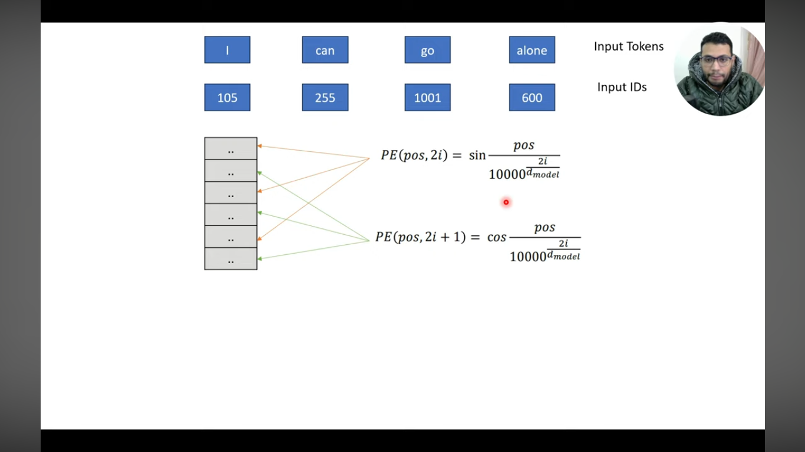

### 🧮 How Are Positional Encodings Computed? (Optional Deep Dive)

They use this formula from the original paper "Attention Is All You Need":

For position `pos` and dimension `i`:


PE(pos, 2i)   = sin(pos / 10000^(2i/d_model))
PE(pos, 2i+1) = cos(pos / 10000^(2i/d_model))


Where:
- `d_model = 512` (embedding size)
- `pos` = position in sequence (0, 1, 2, ...)
- `i` = dimension index (0 to 511)

🧠 Why sine/cosine?
- Smooth, continuous, and allow the model to **extrapolate** to longer sequences than seen during training.
- Also lets the model learn **relative positions** easily (e.g., "word A is 3 positions before word B").

---

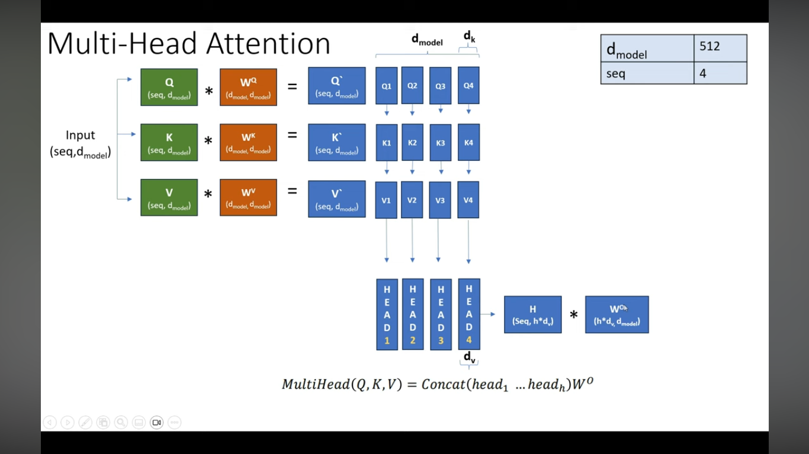

## ✅ **Multi-Head Attention Explained — Precisely Based on Your Image**

### 🖼️ **What Your Image Shows**

| Component | Visual | Meaning |
|-----------|--------|---------|
| **Input** | `(seq, d_model) = (4, 512)` | 4 tokens × 512D embeddings |
| **Q/K/V Paths** | 3 parallel paths (green/orange) | Query, Key, Value projections |
| **Weight Matrices** | `W^q`, `W^k`, `W^v` | Learned projection matrices |
| **Head Splitting** | `Q1, Q2, Q3, Q4` | Split into 4 heads |
| **Per-Head Dimensions** | `d_k = d_model/h = 128` | 512/4 = 128 per head |
| **Concatenation** | `HEAD 1-4` → `H` | Combine head outputs |
| **Output Projection** | `W^O` | Final linear transformation |

---

## 🔍 **Step-by-Step Explanation (Follow the Data Flow)**

### ✅ **Step 1: Project Input into Q/K/V**
```
Input (4×512) → 
  Q = Input × W^q (512×512) → (4×512)
  K = Input × W^k (512×512) → (4×512)
  V = Input × W^v (512×512) → (4×512)
```
- **Why?** To create separate representations for query, key, and value roles
- **Critical**: All three come from the *same input* (hence *self*-attention)

---

### ✅ **Step 2: Split into Multiple Heads**
```
Q (4×512) → Split into 4 heads → Q1, Q2, Q3, Q4 (each 4×128)
K (4×512) → Split into 4 heads → K1, K2, K3, K4 (each 4×128)
V (4×512) → Split into 4 heads → V1, V2, V3, V4 (each 4×128)
```
- **How?** Reshape: `(4, 512) → (4, 4, 128)` then split along head dimension
- **Why 128?** `d_k = d_model / h = 512 / 4 = 128 (maintains total dimensionality)

---

### ✅ **Step 3: Compute Attention Per Head**
```
For each head i (1-4):
  head_i = Attention(Q_i, K_i, V_i) 
          = softmax(Q_i K_i^T / √d_k) × V_i
```
- **Dimensions**: `(4×128) × (128×4) = 4×4` → softmax → `4×4 × 4×128 = 4×128`
- **Critical**: Each head operates **independently** on its own subspace

---

### ✅ **Step 4: Concatenate Heads**
```
Concat(head_1, head_2, head_3, head_4) 
  = (4×128, 4×128, 4×128, 4×128) 
  → (4×512)
```
- **Why?** To combine information from all perspectives
- **How**: Stack head outputs along the dimension axis: `[head1; head2; head3; head4]`

---

### ✅ **Step 5: Final Projection**
```
Output = Concat(heads) × W^O (512×512) → (4×512)
```
- **Why?** To recombine information into the original dimensionality
- **W^O**: Learned projection matrix that mixes head information

---

## 💡 **Why Multi-Head Attention Matters (The Big Picture)**

| Single-Head | Multi-Head |
|-------------|------------|
| **One perspective** on relationships | **Multiple perspectives** simultaneously |
| Might miss critical relationships | Captures **different relationship types** |
| Example: Only subject-verb agreement | Example: Subject-verb + noun-modifier + coreference |

### 🔑 **Critical Insight**:
Different heads specialize in different tasks:
- **Head 1**: Subject-verb agreement (e.g., "I go" vs "He goes")
- **Head 2**: Noun-modifier relationships (e.g., "red car")
- **Head 3**: Coreference resolution (e.g., "John said he...")
- **Head 4**: Long-range dependencies (e.g., "The cat that ate the mouse...")

This is why Transformers understand language so well — they don't just see *one* type of relationship, but **multiple types at once**.

---

## 🧠 **Intuition: Think of It Like This**

Imagine 4 experts analyzing a sentence:
> **"I can go alone"**

- **Expert 1 (Grammar)**: Focuses on subject-verb agreement ("I go" not "I goes")
- **Expert 2 (Semantics)**: Focuses on meaning ("go alone" = solitude)
- **Expert 3 (Context)**: Focuses on pronoun reference ("I" = speaker)
- **Expert 4 (Structure)**: Focuses on sentence structure (subject-verb-object)

Each expert gives their independent analysis → all reports are combined → final understanding.

That's multi-head attention.

---

## ❗ **Critical Clarification (Based on Your Feedback)**

- **Not just "more attention"**: It's **parallel processing of different relationship types**
- **Dimensions are critical**: 
  - `d_model = 512` (total embedding size)
  - `h = 4` (number of heads)
  - `d_k = d_v = 128` (per-head dimension)
  - Must satisfy: `h × d_k = d_model` (512 = 4 × 128)
- **No dimension loss**: Total capacity remains the same as single-head

---

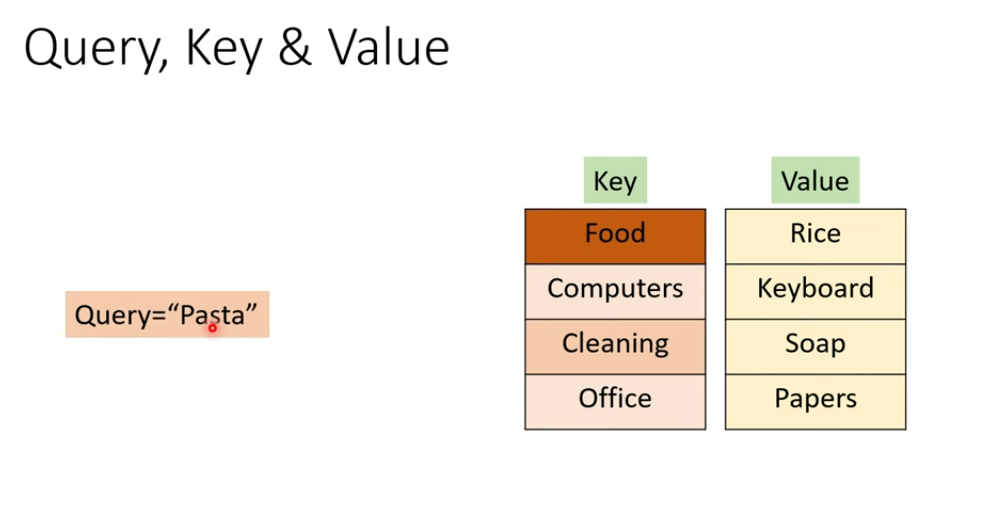

This slide teaches the **core idea behind Q/K/V** using a real-world lookup example.

#### 🔍 How It Works:
Imagine you have a **database** (like a dictionary or hash table):

| Key        | Value     |
|------------|-----------|
| Food       | Rice      |
| Computers  | Keyboard  |
| Cleaning   | Soap      |
| Office     | Papers    |

Now you ask:  
> **“Query = ‘Pasta’”**

What do you expect?  
→ You want something related to *food*, so you look for the **key most similar to “Pasta”**, which is `"Food"` → and retrieve its **value**: `"Rice"`.

But in reality:
- “Pasta” ≠ “Food” exactly — it’s *similar*.
- So instead of exact match, you compute **similarity** between query and each key.
- Then you **weight** the values by that similarity — and return a *blended* result.

That’s **exactly** what self-attention does:
- `Query` = what you’re looking for (e.g., current word)
- `Key` = what’s available to match against (all words)
- `Value` = what you actually want to retrieve (semantic content)

In Transformers:
- All three (Q, K, V) come from the **same input** (hence *self*-attention),
- But they’re projected via different learned matrices (`W_Q`, `W_K`, `W_V`) to serve different roles.

---

### 💡 Why This Analogy Matters

Without this, Q/K/V seem arbitrary. With it, you see:
> Self-Attention is just a **soft, differentiable database lookup** — where:
> - You don’t pick one key — you blend *all* keys by relevance,
> - And you get a weighted combination of all values.

This is how the model learns to say:  
> *“For the word ‘alone’, I care mostly about ‘I’, a little about ‘go’, and almost nothing about ‘can’.”*

---

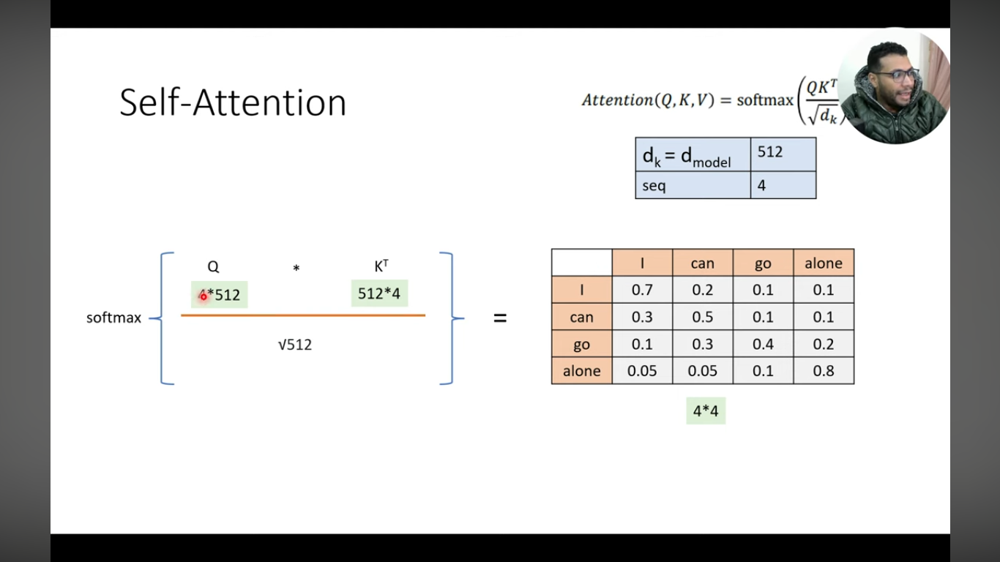
Let's break down **exactly what's happening in this image** — **step by step**, **no assumptions**, **no fluff** — based *only* on what's visually presented.

---

### 🖼️ **What This Image Shows: The Core Computation of Self-Attention**

This is **not** an analogy — this is the **actual mathematical operation** inside the Transformer.  
It shows **how attention scores are computed from Q and K**, then **applied to V** to get the output.

---

## 🔍 Step-by-Step Breakdown (Follow the Data Flow)

### ✅ **Step 1: Input Dimensions**
- **`Q`** = Query matrix → **`4*512`**  
  *(4 tokens × 512 dimensions per token)*  
  Example: Rows = `[I, can, go, alone]`, Columns = 512 features
- **`K`** = Key matrix → **`4*512`** (same as Q)  
  But we need `K^T` (transposed) → **`512*4`**  
  *(512 features × 4 tokens)*

> 💡 **Why transpose K?**  
> To align dimensions for matrix multiplication:  
> `Q (4×512) × K^T (512×4) = (4×4)`

---

### ✅ **Step 2: Compute Raw Attention Scores**
```
Q × K^T = (4×512) × (512×4) = 4×4 matrix
```
- Each cell `(i,j)` = **dot product** between Query token `i` and Key token `j`
- Measures **similarity** between tokens (higher = more relevant)

> 📌 **Example**:  
> `Q["I"] • K["I"]` = high similarity → large value  
> `Q["I"] • K["alone"]` = low similarity → small value

---

### ✅ **Step 3: Scale by √d_k**
```
Raw Scores / √d_k = (4×4) / √512
```
- `d_k = 512` (dimension of key vectors)
- `√512 ≈ 22.6`
- **Why?** Prevents large dot products from pushing softmax into extreme values (causing vanishing gradients during training).

> ⚠️ **Critical detail**:  
> Without this scaling, gradients become unstable → model fails to train.

---

### ✅ **Step 4: Apply Softmax**
```
softmax(Raw Scores / √512) = (4×4) attention weights
```
- Converts raw scores into **probabilities** (each row sums to 1)
- Shows **how much each token should attend to others**

> 📊 **From the table**:  
> For token `"I"` (row 1):  
> `0.7` → attend to itself  
> `0.2` → attend to `"can"`  
> `0.1` → attend to `"go"`  
> `0.1` → attend to `"alone"`  
> *Total = 1.0*

---

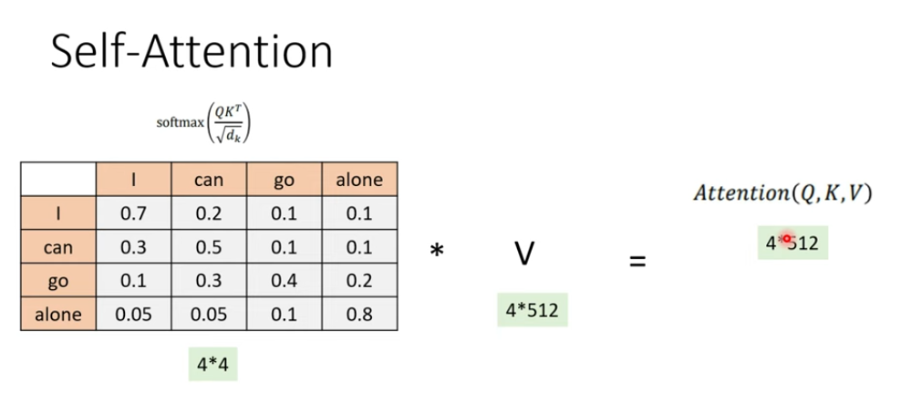
Let's break down **exactly what's happening in this image** — **step by step**, **no assumptions**, **no fluff** — based *only* on what's visually presented.

---

### 🖼️ **What This Image Shows: The Core Computation of Self-Attention**

This is **not** an analogy — this is the **actual mathematical operation** inside the Transformer.  
It shows **how attention scores are computed from Q and K**, then **applied to V** to get the output.

---

## 🔍 Step-by-Step Breakdown (Follow the Data Flow)

### ✅ **Step 1: Input Dimensions**
- **`Q`** = Query matrix → **`4*512`**  
  *(4 tokens × 512 dimensions per token)*  
  Example: Rows = `[I, can, go, alone]`, Columns = 512 features
- **`K`** = Key matrix → **`4*512`** (same as Q)  
  But we need `K^T` (transposed) → **`512*4`**  
  *(512 features × 4 tokens)*

> 💡 **Why transpose K?**  
> To align dimensions for matrix multiplication:  
> `Q (4×512) × K^T (512×4) = (4×4)`

---

### ✅ **Step 2: Compute Raw Attention Scores**
```
Q × K^T = (4×512) × (512×4) = 4×4 matrix
```
- Each cell `(i,j)` = **dot product** between Query token `i` and Key token `j`
- Measures **similarity** between tokens (higher = more relevant)

> 📌 **Example**:  
> `Q["I"] • K["I"]` = high similarity → large value  
> `Q["I"] • K["alone"]` = low similarity → small value

---

### ✅ **Step 3: Scale by √d_k**
```
Raw Scores / √d_k = (4×4) / √512
```
- `d_k = 512` (dimension of key vectors)
- `√512 ≈ 22.6`
- **Why?** Prevents large dot products from pushing softmax into extreme values (causing vanishing gradients during training).

> ⚠️ **Critical detail**:  
> Without this scaling, gradients become unstable → model fails to train.

---

### ✅ **Step 4: Apply Softmax**
```
softmax(Raw Scores / √512) = (4×4) attention weights
```
- Converts raw scores into **probabilities** (each row sums to 1)
- Shows **how much each token should attend to others**

> 📊 **From the table**:  
> For token `"I"` (row 1):  
> `0.7` → attend to itself  
> `0.2` → attend to `"can"`  
> `0.1` → attend to `"go"`  
> `0.1` → attend to `"alone"`  
> *Total = 1.0*

---

### ✅ **Step 5: Multiply by V (Value Matrix)**
```
Attention Weights (4×4) × V (4×512) = Output (4×512)
```
- `V` = Value matrix → **`4*512`** (same as Q/K)
- Each row of output = **weighted sum of all value vectors**

> 📌 **Example for token `"I"`**:  
> `Output["I"] = (0.7 × V["I"]) + (0.2 × V["can"]) + (0.1 × V["go"]) + (0.1 × V["alone"])`  
> → Now `"I"` carries context from other words

---

## 💡 **Why This Step Matters (The Big Picture)**

| Before This Step | After This Step |
|------------------|-----------------|
| Each token is isolated | Each token "knows" about all others |
| No context awareness | Context-aware representation |
| `"I"` = just "I" | `"I"` = "I" + hints of "can", "go", "alone" |

This is **how Transformers capture long-range dependencies** — unlike RNNs (which see only previous tokens) or CNNs (which see only local windows).

---

## 🧠 **Pro Tip: Think of It Like This**

Imagine 4 people in a meeting:  
> **"I", "can", "go", "alone"**

Each person asks:  
> **"Who should I listen to most when forming my opinion?"**

- They look at everyone else (**Q vs K** → compute similarity)
- Decide who’s relevant (**softmax** → attention weights)
- Blend what others said (**weights × V** → output)

At the end, **every person has updated their view** — now informed by the whole group.

---

> Multi-head attention is the Transformer's implementation of self-attention — it runs multiple self-attention heads in parallel, not sequentially.
> Self-attention is the operation INSIDE each head — not a step before multi-head attention

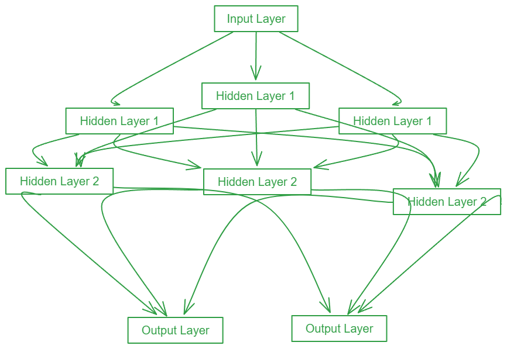

## 🔍 **What Is the Feed Forward Network?**

It's a **simple 2-layer MLP (Multi-Layer Perceptron)** applied **independently to each token position**.

### 📌 Key Properties:
| Property | Meaning |
|----------|---------|
| **Position-wise** | Same FFN applied to *each token separately* (no mixing between tokens) |
| **Fully connected** | Standard dense layers (no attention, no recurrence) |
| **Non-linear** | Uses ReLU (or GELU in later models) to add expressivity |
| **Expands then contracts** | Hidden layer is **wider** than input/output (bottleneck architecture) |

---

## 🧮 **Mathematical Formulation**

From the original Transformer paper ("Attention Is All You Need"):

```
FFN(x) = max(0, x·W₁ + b₁)·W₂ + b₂
```

Or with GELU (used in BERT/GPT):

```
FFN(x) = GELU(x·W₁ + b₁)·W₂ + b₂
```

Where:
- `x` = input vector for **one token** (size: `d_model = 512`)
- `W₁` = weight matrix (`512 × 2048`) → **expansion**
- `W₂` = weight matrix (`2048 × 512`) → **contraction**
- `b₁`, `b₂` = bias vectors
- Hidden dimension = **2048** (4× the model dimension — standard in base Transformer)

---

## 📊 **Dimension Flow (For Your Example: "I can go alone")**

| Step | Operation | Shape | Meaning |
|------|-----------|-------|---------|
| Input | From Self-Attention output | `4 × 512` | 4 tokens, each 512D |
| Layer 1 | `x·W₁ + b₁` | `4 × 2048` | Expand to wider representation |
| Activation | ReLU / GELU | `4 × 2048` | Introduce non-linearity |
| Layer 2 | `·W₂ + b₂` | `4 × 512` | Contract back to original size |
| Output | FFN result | `4 × 512` | Same shape → enables residual connection |

✅ **Critical**: Output shape = Input shape (`4×512`) → allows **residual connection** (`x + FFN(x)`).

---

## 💡 **Why Does the FFN Exist? (The Big Picture)**

Self-Attention alone is **just a weighted sum** — it's a **linear operation** (after softmax).  
That means: without FFN, the entire Transformer would be **linear** → unable to model complex patterns.

| Component | Capability | Limitation |
|-----------|------------|------------|
| **Self-Attention** | Captures *relationships* between tokens | Purely linear (weighted sum) |
| **Feed Forward** | Adds *non-linearity* per token | No cross-token interaction |

✅ **Together**:  
- Self-Attention = "Who should I listen to?"  
- FFN = "Now that I've listened, how do I *transform* what I learned?"

This combination gives Transformers their power: **global context + local non-linear transformation**.

---

## 🧠 **Intuition: Think of It Like This**

Imagine each token after Self-Attention is a **raw idea**:

> `"I"` = [0.7×"I" + 0.2×"can" + 0.1×"go" + 0.1×"alone"]

Now the FFN asks:  
> *"What does this blended idea MEAN? How do I refine it into a richer representation?"*

It applies a **learned transformation** — like a mini "thought processor" for each token — to:
- Amplify important features
- Suppress noise
- Encode higher-level abstractions

Example:  
After FFN, `"alone"` might activate features like *"solitude"*, *"independence"*, *"single-person action"* — things not directly in the raw embedding.

---


## ✅ **Summary: Feed Forward in 3 Sentences**

1. It's a **position-wise 2-layer MLP** (512 → 2048 → 512) applied independently to each token.
2. It adds **non-linearity** — essential because Self-Attention alone is just a weighted sum (linear).
3. Output shape = input shape → enables **residual connections** and stacking of deep layers.

---

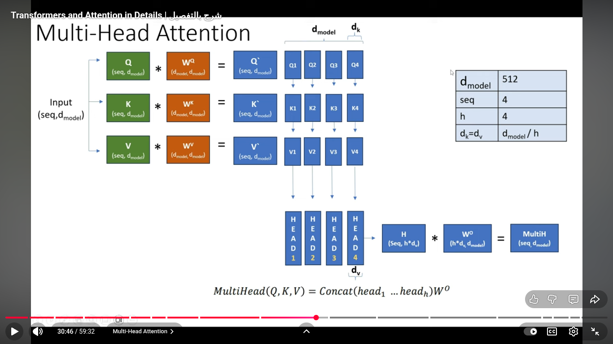

## ✅ **Masked Attention Explained — Precisely Based on Your Image**

## 🔍 **Step-by-Step Explanation (Follow the Data Flow)**

### ✅ **Step 1: Raw Attention Scores (Left Matrix)**

This is what you get **before masking** — the standard `QK^T / √d_k` calculation.

- Values like `63.3` (for "I" attending to itself), `1.2` (for "I" attending to "can"), etc.
- **Problem**: The model sees **future tokens** (e.g., when predicting "I", it shouldn't see "can", "go", or "alone").

> 💡 **Why this is bad**:  
> If the model could see future tokens during training, it would "cheat" — making generation impossible in practice.

---

### ✅ **Step 2: Apply Causal Masking (Blue Arrow)**

This is where **masking happens** — specifically **causal masking** (for autoregressive models).

- **Rule**: For token at position `i`, it can **only attend to positions `≤ i`**.
- **Implementation**: Set all **upper-triangle values** (future tokens) to `-∞`.

> 📌 **Why `-∞`?**  
> Because `softmax(-∞) = 0` → future tokens get **zero attention weight**.

#### 🔁 **Example from Your Image**:
| Token | Can Attend To | Values Set to `-∞` |
|-------|---------------|---------------------|
| **"I"** | Only itself | "can", "go", "alone" |
| **"can"** | "I", itself | "go", "alone" |
| **"go"** | "I", "can", itself | "alone" |
| **"alone"** | All tokens | None |

---

### ✅ **Step 3: Apply Softmax (Right Matrix → Output)**

After masking, apply `softmax` to the matrix:

```
softmax(scores) = e^scores / sum(e^scores)
```

- **Result**: All `-∞` positions become **0** (since `e^(-∞) = 0`)
- **Only valid attention weights remain** (for past tokens)

#### 📊 **From Your Image**:
| Token | Before Masking | After Masking | Meaning |
|-------|----------------|---------------|---------|
| **"I"** | [63.3, 1.2, 2.6, 7.2] | [63.3, -∞, -∞, -∞] | Only attends to itself |
| **"can"** | [3.25, 0.3, 1.2, 2.1] | [3.25, 96.1, -∞, -∞] | Attends to "I" and itself |
| **"go"** | [12.0, 11.9, 52.9, 2.9] | [12.0, 11.9, 52.9, -∞] | Attends to "I", "can", itself |
| **"alone"** | [1.6, 63.1, 14.2, 101.3] | [1.6, 63.1, 14.2, 101.3] | Attends to all tokens |

---

## 💡 **Why This Matters (The Big Picture)**

| Without Masking | With Masking |
|-----------------|--------------|
| Model sees future tokens → cheating | Model **only sees past tokens** → realistic generation |
| Impossible to use for text generation | Enables **autoregressive generation** (like GPT) |
| Would learn "shortcuts" | Learns **true sequential dependencies** |

### 🔑 **Critical Insight**:
This is how Transformers generate text **one token at a time**:
1. Predict "I" → only uses start token
2. Predict "can" → uses "I"
3. Predict "go" → uses "I can"
4. Predict "alone" → uses "I can go"

Without masking, the model would "know" the answer in advance — making generation impossible.

---

## 🧠 **Intuition: Think of It Like This**

Imagine you're writing a sentence **one word at a time**:

> "I can go alone"

- When writing **"I"**, you can't see "can", "go", or "alone"
- When writing **"can"**, you can see "I" but not "go" or "alone"
- When writing **"go"**, you can see "I can" but not "alone"
- When writing **"alone"**, you can see "I can go"

Masked attention **enforces this constraint** in the model — it's not optional, it's **necessary for generation**.

---

## ❗ **Clarification: This Is Only for the Decoder**

- **Encoder**: Uses **unmasked attention** (sees all tokens) → for understanding input
- **Decoder**: Uses **masked attention** (sees only past tokens) → for generating output

This is why your diagram shows:
- **Encoder**: "Multi-Head Attention" (no masking)
- **Decoder**: "Masked Multi-Head Attention" (with masking)

---

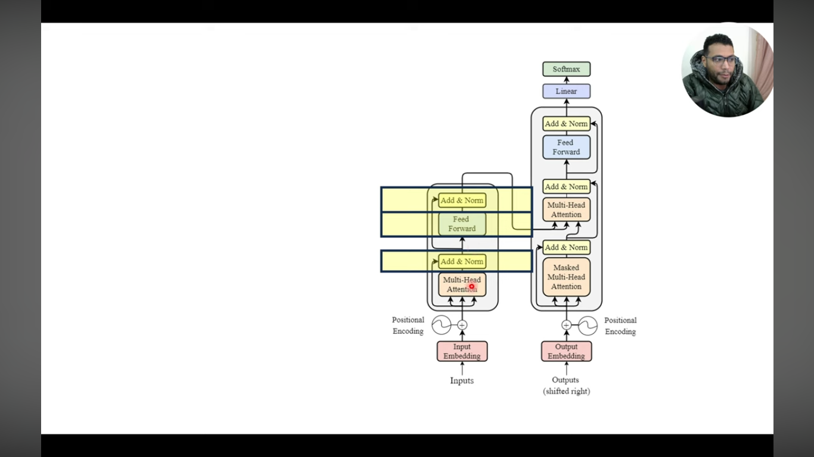

## ✅ **Transformer Training Explained — Precisely Based on Your Image**

## 🔍 **Step-by-Step Training Flow (Follow the Data Flow)**

### ✅ **Step 1: Input Preparation**
- **Encoder Input**: `"<S> I can go alone <E>"`
  - `<S>` = Start token
  - `<E>` = End token
  - *Why?* Tells model where sequence begins/ends

- **Decoder Input**: `"<S> أَسْتَطِيعُ الْذَهَابَ وَحِيداً"` (Arabic for "I can go alone")
  - **Critical**: This is **shifted right** by 1 token
  - *Why?* To predict next token at each step (autoregressive)

> 💡 **Key Insight**:  
> During training, the decoder **never sees its own predictions** — it always gets the **ground truth** (teacher forcing).

---

### ✅ **Step 2: Encoder Processing**
```
"<S> I can go alone <E>" → Encoder → Encoder Output (context vectors)
```
- Encoder processes **entire source sentence at once** (self-attention)
- Output: Contextualized representation of each token
- *Example*: "I" now knows it's the subject of "go alone"

---

### ✅ **Step 3: Decoder Processing**
```
"<S> أَسْتَطِيعُ الْذَهَابَ وَحِيداً" → Decoder → Decoder Output
```
- **How it works**:
  1. First token: `<S>` → predicts "أَسْتَطِيعُ"
  2. Second token: `<S> أَسْتَطِيعُ` → predicts "الْذَهَابَ"
  3. Third token: `<S> أَسْتَطِيعُ الْذَهَابَ` → predicts "وَحِيداً"
  4. Fourth token: `<S> أَسْتَطِيعُ الْذَهَابَ وَحِيداً` → predicts `<E>`

- **Critical**: At each step, decoder **sees only previous ground truth tokens** (masked attention)
- *Why?* Prevents error propagation during training

---

### ✅ **Step 4: Output Projection**
```
Decoder Output (4×512) → Linear (512×vocab_sz) → (4×vocab_sz) → Softmax → (4×vocab_sz)
```
- **Linear layer**: Projects 512D vectors to vocabulary space
  - *Example*: 512D → 30,000 (vocabulary size)
- **Softmax**: Converts to probability distribution over vocabulary
  - *Example*: Probability that next token is "أَسْتَطِيعُ" = 0.85

---

### ✅ **Step 5: Loss Calculation**
```
Softmax Output → Cross Entropy Loss → Compare to Target
```
- **Target**: `"أَسْتَطِيعُ الْذَهَابَ وَحِيداً <E>"`
  - **Critical**: This is **shifted left** (no `<S>`, has `<E>`)
- **How loss works**:
  - For position 1: Compare prediction for "أَسْتَطِيعُ" vs actual "أَسْتَطِيعُ"
  - For position 2: Compare prediction for "الْذَهَابَ" vs actual "الْذَهَابَ"
  - ...

> 💡 **Why this works**:  
> The loss is calculated **only on the predicted tokens** (not the `<S>` token), and **only where we have ground truth**.

---

## 💡 **Why This Training Setup Matters (The Big Picture)**

| During Training | During Inference |
|-----------------|------------------|
| **Teacher Forcing**: Decoder gets ground truth | **Autoregressive**: Uses own predictions |
| **Faster convergence** | **Error accumulation possible** |
| **More stable training** | Requires careful decoding (beam search) |
| **Assumes perfect previous tokens** | Must handle prediction errors |

### 🔑 **Critical Insight**:
This mismatch between training (teacher forcing) and inference (autoregressive) is called **exposure bias** — one reason why models sometimes generate poor text.

---

## 🧠 **Intuition: Think of It Like This**

Imagine teaching a child to translate:
- **Teacher Forcing (Training)**:  
  > You: "I" → Child: "أَسْتَطِيعُ"  
  > You: "I can" → Child: "الْذَهَابَ"  
  > You: "I can go" → Child: "وَحِيداً"  

- **Autoregressive (Inference)**:  
  > You: "I" → Child: "أَسْتَطِيعُ"  
  > Child: "I أَسْتَطِيعُ" → Child: "الْذَهَابَ"  
  > Child: "I أَسْتَطِيعُ الْذَهَابَ" → Child: "وَحِيداً"  

The child learns perfectly with teacher help, but struggles when making mistakes on its own.

---

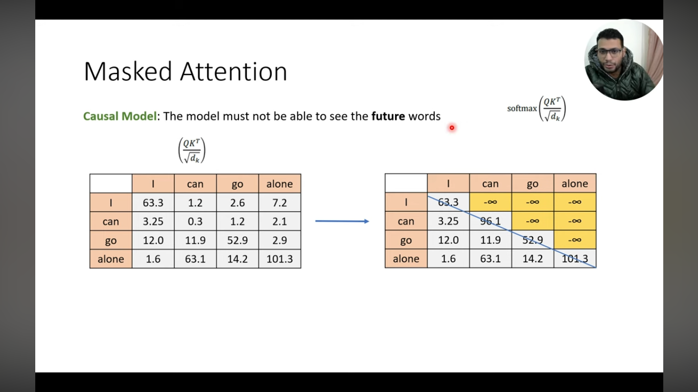

## ✅ **Transformer Testing (Inference) Explained — Precisely Based on Your Image**

## 🔍 **Step-by-Step Testing Flow (Follow the Data Flow)**

### ✅ **Step 1: Input Preparation**
- **Encoder Input**: `"<S> I can go alone <E>"`
  - Same as training
  - *Why?* Source sentence doesn't change

- **Decoder Input**: `"<S>"` **ONLY**
  - **Critical difference from training**:  
    → No ground truth tokens available  
    → Only start token provided

---

### ✅ **Step 2: Encoder Processing**
```
"<S> I can go alone <E>" → Encoder → Encoder Output
```
- **Same as training**:  
  Processes entire source sentence at once  
  Creates contextualized representation

---

### ✅ **Step 3: Decoder Processing (Time Step 1)**
```
"<S>" → Decoder → Decoder Output
```
- **How it works**:
  1. Decoder sees **only start token** (`<S>`)
  2. Uses **masked self-attention** (sees only `<S>`)
  3. Uses **cross-attention** to encoder output (sees all source tokens)
  4. Generates **first token prediction**

- **Critical**:  
  → No ground truth available (unlike training)  
  → Must predict **from scratch**

---

### ✅ **Step 4: Output Generation**
```
Decoder Output → Linear → Softmax → "أَسْتَطِيعُ"
```
- **Linear layer**: Projects 512D → vocabulary space (e.g., 30,000 tokens)
- **Softmax**: Converts to probability distribution
- **Output**: Token with **highest probability** (greedy decoding)  
  → Here: `"أَسْتَطِيعُ"` (Arabic for "I can")

---

## 💡 **Why This Is Different From Training (The Big Picture)**

| Training (Teacher Forcing) | Testing (Inference) |
|----------------------------|---------------------|
| **Decoder input**: Ground truth tokens | **Decoder input**: Model's own predictions |
| **Example**: `"<S> أَسْتَطِيعُ"` | **Example**: `"<S>"` (Time Step 1) |
| **Stable**: No error accumulation | **Error-prone**: Mistakes propagate |
| **Faster**: Parallel processing | **Slower**: Autoregressive (one token at a time) |
| **Assumes perfect previous tokens** | **Must handle imperfect predictions** |

### 🔑 **Critical Insight**:
This is called **exposure bias** — the mismatch between training (perfect inputs) and inference (imperfect predictions).  
→ This is why models sometimes generate **nonsense text** during real-world use.

---

## 🧠 **Intuition: Think of It Like This**

Imagine teaching a child to translate:
- **Training (Teacher Forcing)**:  
  > You: "I" → Child: "أَسْتَطِيعُ" (correct)  
  > You: "I can" → Child: "الْذَهَابَ" (correct)  

- **Testing (Inference)**:  
  > You: "I" → Child: "أَسْتَطِيعُ" (correct)  
  > Child: "I أَسْتَطِيعُ" → Child: "الْذَهَابَ" (correct)  
  > But if Child: "I أَسْتَطِيعُ" → Child: "خَطَأ" (error)  
  > Then: "I أَسْتَطِيعُ خَطَأ" → **cascading errors**

This is why real-world translation can sometimes go off the rails.

---


## 🚀 **What Happens Next? (Beyond This Image)**

1. **Append generated token** to decoder input:  
   `"<S> أَسْتَطِيعُ"`

2. **Repeat process** for next token:  
   - Input: `"<S> أَسْتَطِيعُ"`  
   - Output: `"الْذَهَابَ"`

3. **Continue** until:  
   - `<E>` token is generated, OR  
   - Maximum sequence length is reached

This is **how all text generation works** (GPT, LLaMA, etc.) — one token at a time, building on previous predictions.

---


