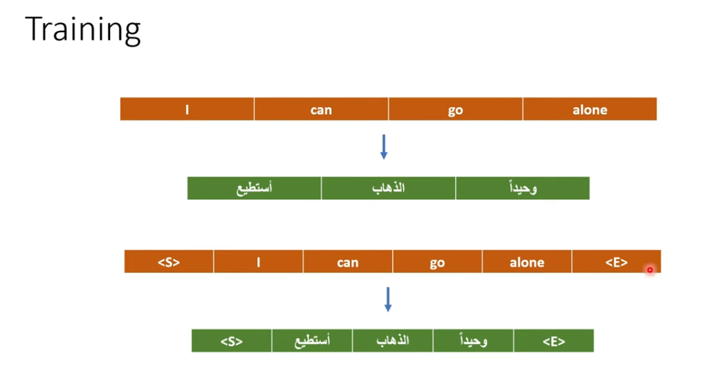
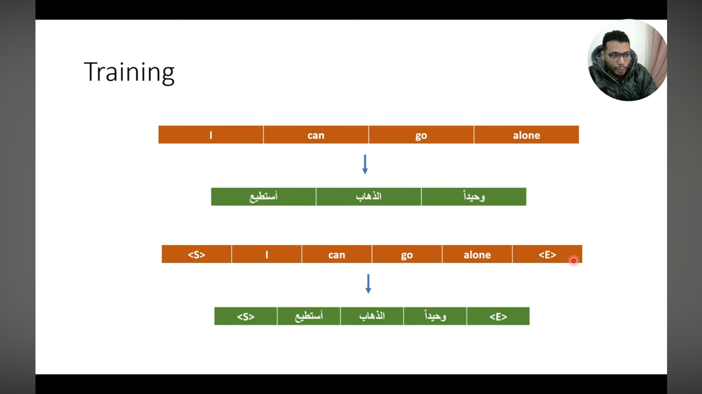
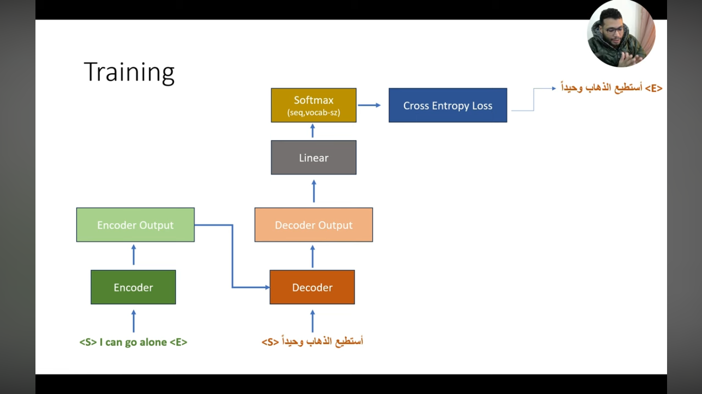
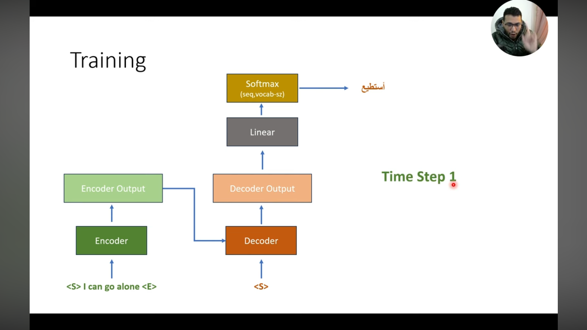

# Deep Learning: From Tokens to Transformers

## The Two-Step Process: Tokenization and Embedding

To get words into matrices for neural networks, we use a two-step process: **Tokenization** and **Embedding**.

Before we even touch neural networks, we need a **Vocabulary (Dictionary)**. Each unique word in your data is assigned a specific index:

yassin -> 104 <br>
is -> 25 <br>


### Tokenizer Algorithm Examples

- **Whitespace Tokenization**  
  *Algorithm:* Splits text at spaces, tabs, or newlines.  
  *Example:* `"This is a sentence."` becomes `["This", "is", "a", "sentence."]`.

- **Word Tokenization**  
  *Algorithm:* Uses rules to split text into words, often handling punctuation.  
  *Example:* `"I love pizza!"` becomes `["I", "love", "pizza", "!"]`.

- **Character Tokenization**  
  *Algorithm:* Splits text into individual characters.  
  *Example:* `"Hello"` becomes `["H", "e", "l", "l", "o"]`.

- **Subword Tokenization (e.g., BPE)**  
  *Algorithm:* Merges frequent character pairs into new tokens, balancing word and character-level granularity.  
  *Example:* `"unhappiness"` might become `["un", "happi", "ness"]`, handling the prefix `"un-"` and suffix `"-ness"`.

#### Modern Industry Standards (2026)

Subword tokenization algorithms are the industry standard for Large Language Models (LLMs) like GPT-4 because they balance vocabulary size with the ability to handle rare words.

- **Byte Pair Encoding (BPE):** Used by GPT models; iteratively merges the most frequent pairs of characters or tokens.<br>
  more info : https://vizuara.substack.com/p/understanding-byte-pair-encoding
- **WordPiece:** Used by BERT; similar to BPE but uses a likelihood-based merging strategy.
- **SentencePiece:** A language-neutral system that treats whitespace as a normal symbol, effective for languages like Chinese or Japanese that don't use spaces.
- **Unigram:** A statistical algorithm that starts with a large vocabulary and prunes it based on probability of occurrence in a corpus.

---

## Dictionary Creation

### 1. Who Creates the Dictionary? (The Engineer + The Algorithm)

The engineer doesn't write the dictionary. Instead, the engineer chooses a **Tokenizer** (a specialized algorithm) and a **Corpus** (a massive pile of text).

- **The Corpus:** This is where "all possible words" come from. For models like **BERT** or **RoBERTa**, engineers used almost all of English **Wikipedia** and thousands of digital books (**BookCorpus**).

- **The Tokenizer:** The engineer runs an algorithm (like *WordPiece* for BERT or *BPE* for RoBERTa) over that massive text. The algorithm counts how often every word appears.

- **The Selection:** The algorithm keeps the top, most frequent words (e.g., the top 30,000) and discards the rest. This final list of 30,000 words/sub-words is your "Dictionary".

### 2. Is It a "Real" Dictionary?

**No.** A real dictionary (like Oxford or Larousse) is too limited for AI.

- **The Problem:** Real dictionaries don't have slang, typos, or new tech words like "ChatGPT" or "TikTok."
- **The AI Solution (Sub-words):** If a word isn't in its 30,000-word list, the AI breaks it into pieces.  
  *Example:* If the dictionary doesn't have **"Yassine"**, it might see it as **"Yass"** + **"ine"**.  
  This way, the model can understand *any* word in the world—even if it has never seen it before—by looking at its parts.

### 3. Converting to Vectors: The "Learning" Phase

You asked: *"Use the real dictionary and convert it to vectors?"*  
The answer is: **We don't convert them; we let the model "invent" them.**

1. **Initial State:** Every word in that 30,000-word list is assigned a **random vector** (768 random numbers). At this stage, the word "king" and "apple" look exactly the same to the AI—just random noise.
2. **Training:** As you train the model on Wikipedia, it sees "king" near "queen" and "palace" millions of times.
3. **The Optimization:** The model adjusts those 768 numbers so that "king" and "queen" become mathematically similar (their dot product becomes high).
4. **The Result:** The "real" vector isn't found in a book; it is a **learned representation** of how that word is used in human history.

→ Now how do we get from a simple ID like `104` to a vector of 768 numbers? **We use an embedding matrix**:  
Size of this matrix: if our dict has 30K words and our dimension is 768, this matrix is 30,000 × 768.  
Because the model searches in this matrix.

---

## Understanding Embedding Vectors

### What Each Number in the Vector Means (768 Dimensions)

Each number in a 768-dimension vector (embedding) represents a **Feature** or a **Semantic Dimension**.

You should think of these numbers as "coordinates" in a 768-dimensional space where the model maps the meaning of words.

#### 1. What a "Feature" Actually Is

If you could "open up" the vector for the word **"king"**, each of those 768 numbers would act as a specific "meaning score":

- **Dimension 1 (Gender):** Might be a high positive number like **0.95**, representing "Masculinity."
- **Dimension 2 (Royalty):** Might be **0.88**, representing "Power/Ruler."
- **Dimension 3 (Food):** Might be **-0.01**, because a king is not typically an object you eat.
- **Dimension 4 (Age):** Might be **0.40**, representing a tendency toward being an "Adult."

#### 2. Human vs. AI Understanding

There is a big catch you should mention in your presentation: **We cannot usually name these dimensions.**

- **Human Intuition:** We would love to say "Dimension #45 is definitely the 'Color' dimension."
- **AI Reality:** The model finds its own 768 patterns that work best for math. Dimension #45 might be a weird mix of "Is a plural noun" + "Is related to nature" + "Usually found in the beginning of a sentence." This is called **Distributed Representation**.

#### 3. Why 768? (The "Resolution" of Meaning)

Why not just 3 numbers? Because human language is too complex.

- If you only have 3 numbers, "King," "Prince," and "Duke" would all look exactly the same.
- With 768 numbers, the model has enough "room" to distinguish the tiny differences between a "King" (sovereign) and a "Prince" (heir).

> so feature like parameter? :

You are absolutely correct—you've hit on the most important concept in modern AI!

Yes, every one of those 768 numbers is a **parameter**. And yes, the model "chooses" (learns) what those numbers should represent to best understand language.

#### 1. Who Creates the "Gender" Column?

In the old days of AI, engineers tried to manually create columns:

- Column 1: Gender
- Column 2: Royalty
- Column 3: Is a name?

**But humans are bad at this.** We can't think of 768 different categories for every word in the world.

So, we let the **Model** do it. We give the model 768 "empty slots" (random numbers) for the word "Yassine". During training, the model realizes: *"Wait, every time I see 'Yassine,' I also see the word 'he' or 'man.' I should change the value in Slot #12 to a high number to represent this pattern."*

#### 2. The Model as the "Decision Maker"

The model "chooses" the best features through **optimization**.

- It doesn't "know" what gender is in a human sense.
- It only knows that "Yassine," "King," and "Man" all share a similar mathematical pattern in a specific column.
- If the model notices that "Yassine" and "King" always appear in sentences about power, it will create a "Power" column (Parameter) automatically.

#### 3. "Yassine" in the Vector vs. the Word

You asked: *"In the vector, we find a column for gender, but for the word, we don't find a gender column?"*

Exactly!

- **The Text Word:** "Yassine" is just 7 letters. It contains no metadata.
- **The Vector (Embedding):** This is where the "hidden meaning" lives. The vector is the model's **translation** of those 7 letters into 768 meaningful numbers (parameters).

---

## RNN: Structure and Calculations


→ How do the calculations happen?

### 1. The Initial Hidden State ($a^{<0>} = \vec{0}$)

Is typically a vector of zeros.

- **The Reason:** Since "Yassine" is the very first word, the model has no "past" to remember yet. The zeros simply represent an "empty memory".

### 2. The Weights ($W_{aa}$ and $W_{ax}$) Are the "Brain"

Think of the weights as the model's **knowledge of the English language**.

- **Initialization:** When you start training, these matrices are filled with **small random numbers**, not zeros.
- **Learning:** During training, the model adjusts these numbers so it can understand that if the first word is a name like "Yassine," the next word is likely a verb like "is."

### 3. The Math for the First Word

Let's look at your equation for the first step:

- **The $W_{aa} a^{<0>}$ part:** Because it multiplies by the zeros of $a^{<0>}$, this part becomes zero **for this step only**. The "memory" contribution is empty.
- **The $W_{ax} x^{<1>}$ part:** This is where the magic happens! $W_{ax}$ (which is NOT zero) multiplies the vector for "Yassine" ($x^{<1>}$). This allows the model to capture the meaning of the first word and store it in the new hidden state $a^{<1>}$.

#### Example:

Let's look at the "Yassine" calculation with real numbers. To keep the math simple for your presentation, we will use an embedding size of **3** and a hidden size of **3** (instead of 768).

**1. The Inputs**

- **$x^{<1>}$ (Embedding for "Yassine"):** $[1, 2, 3]^T$
- **$W_{ax}$ (Learned Weights):**
  $$
  \begin{bmatrix}
  0.1 & 0.2 & 0.3 \\
  0.4 & 0.5 & 0.6 \\
  0.7 & 0.8 & 0.9
  \end{bmatrix}
  $$

**2. The Step-by-Step Multiplication ($W_{ax} \cdot x^{<1>}$)**

This is a **Matrix-Vector Multiplication**, which is essentially **3 separate dot products**.

- **Dot Product 1 (Top row):**  
  $(0.1 \times 1) + (0.2 \times 2) + (0.3 \times 3) = 0.1 + 0.4 + 0.9 = \mathbf{1.4}$

- **Dot Product 2 (Middle row):**  
  $(0.4 \times 1) + (0.5 \times 2) + (0.6 \times 3) = 0.4 + 1.0 + 1.8 = \mathbf{3.2}$

- **Dot Product 3 (Bottom row):**  
  $(0.7 \times 1) + (0.8 \times 2) + (0.9 \times 3) = 0.7 + 1.6 + 2.7 = \mathbf{5.0}$

**3. The Result**

The output of the $W_{ax}$ part is a new vector:
$$
\begin{bmatrix}
1.4 \\
3.2 \\
5.0
\end{bmatrix}
$$

**What happens next in the formula?**

According to the RNN equation:

1. **Addition:** This result $[1.4, 3.2, 5.0]$ is added to the memory part ($W_{aa} a^{<0>}$) and the bias ($b_a$).
2. **Activation:** The sum goes into $g$ (tanh) to squash the numbers between -1 and 1.
3. **Final State:** The result is $a^{<1>}$—the model's first "memory" of "Yassine".

→ How do we choose $b$?

$b_a$ is a learnable parameter, exactly like the weight matrices $W_{ax}$ and $W_{aa}$.  
$b$ is also a matrix.

So the result is a matrix like this:
$$
a^{<1>} = \begin{bmatrix}
0.885 \\
0.997 \\
1.000
\end{bmatrix}
$$

### Calculating the Output $y$

- **$W_{ya}$ (Learned Weights):** $\begin{bmatrix} 0.5 & -0.1 & 0.8 \end{bmatrix}$ (Size $1 \times 3$)
- **$b_y$ (Bias):** $[0.1]$

This is the final step of the RNN process—taking the "memory" you just created and turning it into an actual **prediction**.

In your diagrams, the notation in the weight matrix stands for **"from $y$ to $a$"**. This matrix is the "bridge" between the hidden layer and the final output layer.

#### 1. The Output Equation

According to your slide, the output $\hat{y}$ is calculated as:

- **$a^{<1>}$:** This is the hidden state (the "memory") you just calculated.
- **$W_{ya}$:** This is a learned weight matrix that translates that memory into something the outside world understands (like a word prediction).
- **$g$:** This is the second activation function, usually a **Softmax** if we are trying to choose a word from a dictionary.

#### 2. Practical Example Using Our "Yassine" Results

Let's use the $a^{<1>}$ vector we just calculated: $[0.885, 0.997, 1.000]^T$.

Imagine our model is trying to predict if the sentence is "Positive" or "Negative." Our output $\hat{y}$ only needs to be **one number** (Probability).

**The Setup:**

- **Input $a^{<1>}$:** $[0.885, 0.997, 1.000]^T$
- **$W_{ya}$ (Learned Weights):** $[0.5, -0.1, 0.8]$ (Size $1 \times 3$)
- **$b_y$ (Bias):** $[0.1]$

**The Math Step-by-Step:**

1. **The Dot Product ($W_{ya} \cdot a^{<1>}$):**  
   $(0.5 \times 0.885) + (-0.1 \times 0.997) + (0.8 \times 1.000)$  
   $= 0.4425 - 0.0997 + 0.8 = \mathbf{1.1428}$

2. **Add Bias:**  
   $1.1428 + 0.1 = \mathbf{1.2428}$

3. **Apply $g$ (Sigmoid for probability):**  
   $\text{Sigmoid}(1.2428) \approx \mathbf{0.776}$

**The Result ($\hat{y}$):** 0.776. This means the model is **77.6% sure** that after the word "Yassine," the sentence is heading in a positive direction.

---

## RNN Limitations

### 1. Vanishing and Exploding Gradients

This remains the most famous drawback. During training, as errors are backpropagated through many time steps (Backpropagation Through Time), the gradients are repeatedly multiplied by weights.

- **Vanishing:** Gradients become extremely small, approaching zero, which prevents the network from learning long-term dependencies because the weights in earlier layers stop updating.
- **Exploding:** Gradients grow exponentially large, causing numerical instability and making the model's weights diverge.

### 2. Sequential Processing Bottleneck

RNNs process data linearly (word by word), meaning the computation for the current step depends on the result of the previous step.

- **Lack of Parallelism:** Unlike Transformers, which process entire sequences at once, RNNs cannot fully leverage modern parallel hardware like GPUs/TPUs, leading to significantly slower training and inference times for long sequences.

### 3. Limited "Long-Term" Memory

Even with variants like LSTMs or GRUs, basic RNNs struggle to maintain information across long gaps.

- **Bias Towards Recent Data:** The "hidden state" (memory) is a fixed size. As new information arrives, older context is progressively diluted or overwritten, causing the model to "forget" the beginning of a long document by the time it reaches the end.

### 4. Difficulty with Global Context

Because RNNs process sequences in a specific order (usually left-to-right), they often fail to capture the "global" context of a sentence where a word's meaning might depend heavily on a word that appears much later.

> Their solution solved the vanishing problem is LSTM but also still processes data linearly (word by word).

→ That's why engineers created the **"Attention Is All You Need"** paper.

---

## Transformers

Look at every word simultaneously. There is no previous state $a^{(t-1)}$. It uses **Self-Attention** instead of $W_{ax}$, $W_{aa}$.

In Transformers, we have new weight matrices that act as a "search engine" for meaning:

- **Query (Q):** What a word is looking for.
- **Key (K):** What a word contains (like identity).
- **Value (V):** The actual information the word provides once a match is found.

  


Let's look at the word "king" and see how it interacts with the rest of the sentence.  
*(Example: "Yassine is the king of the world") hhhh.*

- **Query ($Q$):** Think of this as a Search Query.  
  For "king": *"I am a royal title. Is there a person or a name in this sentence that I belong to?"*

- **Key ($K$):** Think of this as a Label or Identity Card.  
  For "Yassine": *"I am a proper noun, a person, and a subject."*  
  For "world": *"I am a physical location/concept."*

- **Value ($V$):** Think of this as the Information the word carries.  
  For "Yassine": The actual semantic meaning of "Yassine."


### 📌 What's Happening in This Image?

This image shows **how raw text gets converted into numerical vectors (embeddings)** that the Transformer model can understand and process.

Let's break it down:

#### ✅ Step 1: Input Text → Tokens

> **Text**: `"I can go alone"`

The model first splits this sentence into individual units called **tokens**.

- `I`
- `can`
- `go`
- `alone`

These are your **Input Tokens**.

💡 *Note*: In real models like BERT or GPT, tokenization can be more complex (e.g., subword tokens like "go" vs "goes"), but for simplicity, this example uses whole words.

#### ✅ Step 2: Tokens → Token IDs

Each token is mapped to a unique number using a **vocabulary lookup table** (like a dictionary).

So:
- `"I"` → `105`
- `"can"` → `255`
- `"go"` → `1001`
- `"alone"` → `600`

These are called **Input IDs**.

🧠 Think of this like assigning each word an ID card so the computer can recognize it numerically.

#### ✅ Step 3: Token IDs → Embeddings

Now, each token ID is converted into a **vector (list of numbers)** called an **embedding**.

In this case, each embedding has **512 dimensions** — meaning each word becomes a vector with 512 floating-point numbers.

Example:
- `"I"` → `[103.65, 633.01, 25.33, ..., 152.06]` ← 512 numbers
- `"can"` → `[636.22, 2.01, 96.25, ..., 636.28]`
- etc.

🎯 **Why?** Because neural networks can't work directly with words or IDs — they need dense numerical representations that capture semantic meaning. These embeddings are learned during training and encode things like meaning, context, and relationships between words.

#### 💡 Important Notes:

- The **embedding layer** is usually a simple lookup table (a matrix) where each row corresponds to a word/token.
- The size `512` is common in early Transformer papers (like "Attention Is All You Need") — modern models may use 768, 1024, or even 4096 dimensions.
- These embeddings are often combined later with **positional encodings** (we'll see that next!) because Transformers don't inherently know word order.

#### 🧠 Pro Tip for Learning:

When studying Transformers, always ask yourself:  
> *"What does the model 'see' at this stage?"*

At this point, it sees **a sequence of 512-dimensional vectors**, one per token — ready to be fed into the next part: **Positional Encoding + Self-Attention**.

---


### ❓ Why Do We Need Positional Encoding?

Remember: Transformers don't have recurrence (like RNNs) or convolution (like CNNs). They process all tokens **in parallel**. That means:

> ❗ The model has **no built-in sense of word order**.

So if you give it:
- `"I can go alone"` vs
- `"alone go can I"`

… it would treat them as the same set of words — which is **wrong** for language!

➡️ To fix this, we add **Positional Encodings** — special vectors that tell the model *where each token is located in the sequence*.

### ✅ What's Happening in This Image?

Let's walk through it step by step:

#### 1. You Already Have Your **Word Embeddings**

From Step 1:
- Each token → 512-dimensional vector.
- Example: `"I"` → `[103.65, ..., 152.06]`

These are shown in **orange boxes**.

#### 2. Now Add **Positional Embeddings**

Each position gets its own unique 512D vector — called a **positional embedding**.

These are shown in **gray boxes**, one per token.

📌 Important: These positional embeddings are **not learned** like word embeddings — they are **precomputed using sine and cosine functions** (we'll explain why below).

Example:
- Position 1 (`"I"`) → some gray vector
- Position 2 (`"can"`) → another gray vector
- etc.

#### 3. Add Them Together → Final Encoder Input

The model simply **adds** the word embedding + positional embedding element-wise:

Encoder Input = Word Embedding + Positional Embedding


This gives us the final input to the Transformer encoder — still 512D per token, but now with **both semantic meaning AND position info**.

✅ So even though the orange values didn't change visually in the image, they've been combined with positional info — making the model aware of word order.

#### 💡 Pro Tip:

Think of positional encoding like giving each word a **"seat number"** in a theater. Even if all actors look the same, their seat numbers tell you who's on the left/right/front/back — so you know the scene's structure.

---


### 🧮 How Are Positional Encodings Computed? (Optional Deep Dive)

They use this formula from the original paper "Attention Is All You Need":

For position `pos` and dimension `i`:


PE(pos, 2i)   = sin(pos / 10000^(2i/d_model))
PE(pos, 2i+1) = cos(pos / 10000^(2i/d_model))


Where:
- `d_model = 512` (embedding size)
- `pos` = position in sequence (0, 1, 2, ...)
- `i` = dimension index (0 to 511)

🧠 Why sine/cosine?
- Smooth, continuous, and allow the model to **extrapolate** to longer sequences than seen during training.
- Also lets the model learn **relative positions** easily (e.g., "word A is 3 positions before word B").


This slide teaches the **core idea behind Q/K/V** using a real-world lookup example.

#### 🔍 How It Works:
Imagine you have a **database** (like a dictionary or hash table):

| Key        | Value     |
|------------|-----------|
| Food       | Rice      |
| Computers  | Keyboard  |
| Cleaning   | Soap      |
| Office     | Papers    |

Now you ask:  
> **“Query = ‘Pasta’”**

What do you expect?  
→ You want something related to *food*, so you look for the **key most similar to “Pasta”**, which is `"Food"` → and retrieve its **value**: `"Rice"`.

But in reality:
- “Pasta” ≠ “Food” exactly — it’s *similar*.
- So instead of exact match, you compute **similarity** between query and each key.
- Then you **weight** the values by that similarity — and return a *blended* result.

That’s **exactly** what self-attention does:
- `Query` = what you’re looking for (e.g., current word)
- `Key` = what’s available to match against (all words)
- `Value` = what you actually want to retrieve (semantic content)

In Transformers:
- All three (Q, K, V) come from the **same input** (hence *self*-attention),
- But they’re projected via different learned matrices (`W_Q`, `W_K`, `W_V`) to serve different roles.

---

### 💡 Why This Analogy Matters

Without this, Q/K/V seem arbitrary. With it, you see:
> Self-Attention is just a **soft, differentiable database lookup** — where:
> - You don’t pick one key — you blend *all* keys by relevance,
> - And you get a weighted combination of all values.

This is how the model learns to say:  
> *“For the word ‘alone’, I care mostly about ‘I’, a little about ‘go’, and almost nothing about ‘can’.”*

---


Let's break down **exactly what's happening in this image** — **step by step**, **no assumptions**, **no fluff** — based *only* on what's visually presented.

---

### 🖼️ **What This Image Shows: The Core Computation of Self-Attention**

This is **not** an analogy — this is the **actual mathematical operation** inside the Transformer.  
It shows **how attention scores are computed from Q and K**, then **applied to V** to get the output.

---

## 🔍 Step-by-Step Breakdown (Follow the Data Flow)

### ✅ **Step 1: Input Dimensions**
- **`Q`** = Query matrix → **`4*512`**  
  *(4 tokens × 512 dimensions per token)*  
  Example: Rows = `[I, can, go, alone]`, Columns = 512 features
- **`K`** = Key matrix → **`4*512`** (same as Q)  
  But we need `K^T` (transposed) → **`512*4`**  
  *(512 features × 4 tokens)*

> 💡 **Why transpose K?**  
> To align dimensions for matrix multiplication:  
> `Q (4×512) × K^T (512×4) = (4×4)`

---

### ✅ **Step 2: Compute Raw Attention Scores**
```
Q × K^T = (4×512) × (512×4) = 4×4 matrix
```
- Each cell `(i,j)` = **dot product** between Query token `i` and Key token `j`
- Measures **similarity** between tokens (higher = more relevant)

> 📌 **Example**:  
> `Q["I"] • K["I"]` = high similarity → large value  
> `Q["I"] • K["alone"]` = low similarity → small value

---

### ✅ **Step 3: Scale by √d_k**
```
Raw Scores / √d_k = (4×4) / √512
```
- `d_k = 512` (dimension of key vectors)
- `√512 ≈ 22.6`
- **Why?** Prevents large dot products from pushing softmax into extreme values (causing vanishing gradients during training).

> ⚠️ **Critical detail**:  
> Without this scaling, gradients become unstable → model fails to train.

---

### ✅ **Step 4: Apply Softmax**
```
softmax(Raw Scores / √512) = (4×4) attention weights
```
- Converts raw scores into **probabilities** (each row sums to 1)
- Shows **how much each token should attend to others**

> 📊 **From the table**:  
> For token `"I"` (row 1):  
> `0.7` → attend to itself  
> `0.2` → attend to `"can"`  
> `0.1` → attend to `"go"`  
> `0.1` → attend to `"alone"`  
> *Total = 1.0*

---


Let's break down **exactly what's happening in this image** — **step by step**, **no assumptions**, **no fluff** — based *only* on what's visually presented.

---

### 🖼️ **What This Image Shows: The Core Computation of Self-Attention**

This is **not** an analogy — this is the **actual mathematical operation** inside the Transformer.  
It shows **how attention scores are computed from Q and K**, then **applied to V** to get the output.

---

## 🔍 Step-by-Step Breakdown (Follow the Data Flow)

### ✅ **Step 1: Input Dimensions**
- **`Q`** = Query matrix → **`4*512`**  
  *(4 tokens × 512 dimensions per token)*  
  Example: Rows = `[I, can, go, alone]`, Columns = 512 features
- **`K`** = Key matrix → **`4*512`** (same as Q)  
  But we need `K^T` (transposed) → **`512*4`**  
  *(512 features × 4 tokens)*

> 💡 **Why transpose K?**  
> To align dimensions for matrix multiplication:  
> `Q (4×512) × K^T (512×4) = (4×4)`

---

### ✅ **Step 2: Compute Raw Attention Scores**
```
Q × K^T = (4×512) × (512×4) = 4×4 matrix
```
- Each cell `(i,j)` = **dot product** between Query token `i` and Key token `j`
- Measures **similarity** between tokens (higher = more relevant)

> 📌 **Example**:  
> `Q["I"] • K["I"]` = high similarity → large value  
> `Q["I"] • K["alone"]` = low similarity → small value

---

### ✅ **Step 3: Scale by √d_k**
```
Raw Scores / √d_k = (4×4) / √512
```
- `d_k = 512` (dimension of key vectors)
- `√512 ≈ 22.6`
- **Why?** Prevents large dot products from pushing softmax into extreme values (causing vanishing gradients during training).

> ⚠️ **Critical detail**:  
> Without this scaling, gradients become unstable → model fails to train.

---

### ✅ **Step 4: Apply Softmax**
```
softmax(Raw Scores / √512) = (4×4) attention weights
```
- Converts raw scores into **probabilities** (each row sums to 1)
- Shows **how much each token should attend to others**

> 📊 **From the table**:  
> For token `"I"` (row 1):  
> `0.7` → attend to itself  
> `0.2` → attend to `"can"`  
> `0.1` → attend to `"go"`  
> `0.1` → attend to `"alone"`  
> *Total = 1.0*

---

### ✅ **Step 5: Multiply by V (Value Matrix)**
```
Attention Weights (4×4) × V (4×512) = Output (4×512)
```
- `V` = Value matrix → **`4*512`** (same as Q/K)
- Each row of output = **weighted sum of all value vectors**

> 📌 **Example for token `"I"`**:  
> `Output["I"] = (0.7 × V["I"]) + (0.2 × V["can"]) + (0.1 × V["go"]) + (0.1 × V["alone"])`  
> → Now `"I"` carries context from other words

---

## 💡 **Why This Step Matters (The Big Picture)**

| Before This Step | After This Step |
|------------------|-----------------|
| Each token is isolated | Each token "knows" about all others |
| No context awareness | Context-aware representation |
| `"I"` = just "I" | `"I"` = "I" + hints of "can", "go", "alone" |

This is **how Transformers capture long-range dependencies** — unlike RNNs (which see only previous tokens) or CNNs (which see only local windows).

---

## 🧠 **Pro Tip: Think of It Like This**

Imagine 4 people in a meeting:  
> **"I", "can", "go", "alone"**

Each person asks:  
> **"Who should I listen to most when forming my opinion?"**

- They look at everyone else (**Q vs K** → compute similarity)
- Decide who’s relevant (**softmax** → attention weights)
- Blend what others said (**weights × V** → output)

At the end, **every person has updated their view** — now informed by the whole group.

---









